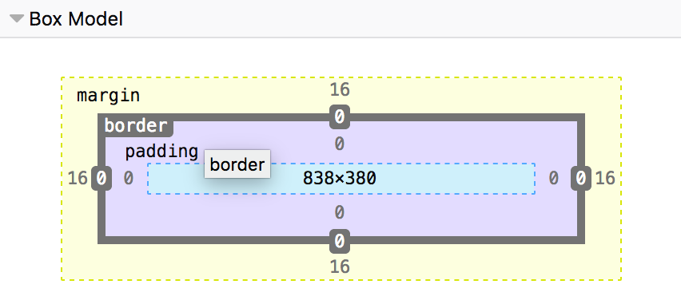

# Liberty JS Notes

## TALK - War stories of coding standards

Twitter: [@onel0p3z](https://twitter.com/onel0p3z)

### Standards

What?
- Guidelines
- Conventions
- Programming Styles
- Best Practices

Why?
- Catch common errors early
- Readability
- Predictable
- Ease learn curve for new devs

Who?
- TEAM if possible
    - Leave your ego out the door
- You if you're the SME
    - Find the sweet spot

When?
- At the beginning of a project
- In the middle, it's ok, but it requires more attention
- Taking over a project

### Linting & Formatting

- JS Hint
- standard JS
- XO
- Prettier

- mostly in a config file (i.e. .eslintrc)

#### Enforcing
git hooks via [husky](https://npm.im/husky)

### Examples of Implementations
Guides
- Airbnb
- Google

### Configuration
- eslint - recommended

### Antipatterns (oh no you didn't!)
- Disable comments
    - `// eslint-disable-next-line`
- Ignore commit hooks

### What about the monsters?
- ego (yourself)
- educate
    - if you're the expert on the team, bring others up to your level

### Takeaways
- Always have a plan
- Document the h*ck out of it
- Enforce & delegate; it's a *team effort*
- Continuous improvement

### Resources
- [idiomatic.js](https://github.com/rwaldron/idiomatic.js)
- [ES lint](https://eslint.org/docs/rules)
- [Slides](https://slides.com/onel0p3z/libertyjs2018)

## TALK - Everything You Need to Know About JS Accessibility

- [Karl Groves](https://twitter.com/karlgroves)

- [WebAIM](https://webaim.org/)

- [Github](https://github.com/karlgroves/axsdialog)

## TALK - Mastering Web Performance Beyond Milliseconds

### Speed - How fast could we possibly go?

- 1/2 web users tend to leave a site that isn't loaded in 3 seconds
- Speed is not ms, it is an experience
    - turn gzip on in nginx config
    - compress images
    - conditional delivery - only send required content
    - Google video on speed improvement

### Speed Perception
- outside factors - sound, temp
- inside factor - emotions
- The holiday paradox - while on vacation, time flies, but when you come back, it feels like a long time
- The age paradox - the older you get, the faster time goes for you

### So what can we do?
- React to user actions
- Spinners remind users that they are waiting
    - You can show something more - more relevant information to user than 'you have to wait'
    - Better alternative - skeleton screen

### Measuring the Perceived Performance
- Do A/B testing - show both and ask which one is faster?

### Can we do better?
-More complex animation

#### "The perception of performance is just as effective as actual performance in many cases."

## TALK - CSS for Backend Developers: How to Stop Fearing Your Stylesheets

- Speaker
    - [@vivgui](https://twitter.com/vivgui)
    - [Site](https://codequeen.io)

### CSS is completely logical and does have order and structure

### Always treat CSS as a first class citizen in your project

### Key takeaway - *Structure*
- Box Model

- Positioning
    - Allows you to take elements out of the normal document layout flow, and make them behave differently
- Specificity
- More exact selectors
- Using ids
- The ultimate specificity fix is your worst nightmre. Don't use `!important`

## TALK - Ask What AI Can Do For You - Machine Learning In Javascript

[Site](https://thekevinscott.com/libertyjs)

### Theory
- TensorFlow.js

### Resources
- [Classifier UI](https://thekevinscott.github.io/ml-classifier-ui/)
- [ml5 js](https://ml5js.org/)

## TALK - Composing Music With Composed Functions
- [Adam Giese](https://twitter.com/adamgiesedev)

### Pure functions
- Given the same arguments, it will return the same value
- No side effects

### Immutability
- Preserves state
- Easier to reason about
    - Prevents unintentional side effects
    - No need to keep track of changes
    - Declarative
- Higher order functions

### Closure
- A function and access to its enclosed state

### Partial application

### Composition

- Libraries
    - ramda
    - tonejs

### Why?

It forces you to break down problems into their smallest parts

## Embraacing the "Native" of React Native

- React Native does NOT
    - Render to a Dom
    - Compile JS code into Java / Obj-c
- React Native DOES
    -Render native views via native SDKs

[React Native](https://facebook.github.io/react-native/)

## Front end Testing You Won't Hate

[Will Mitchell](https://twitter.com/wvmitchell)

### Tests are veggies for our code

[Repo](https://github.com/wvmitchell/eat_yo_veggies)

### Testing with Jest
- Asserting things
- Mocking
- Snapshots

### Enyzme 

### mount vs shallow
